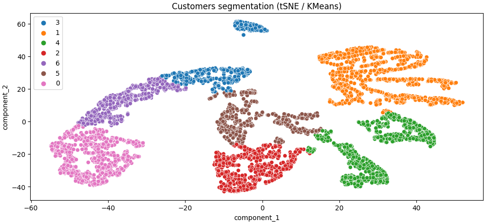

# Shop customers segmentation

## Main goal
Customers segmentation based on their purchasing possibility, frequency of orders and the time period since the last order; determining the optimal strategy for interacting with customers

## Introduction
Most online stores use web analytics tools to track page views, the number and behavior of visitors, and bounce rates. But a report from Google Analytics or a similar system may not be enough to fully understand how customers interact with your site. It is important for companies to be able to quickly and accurately respond to changes in customer behavior by creating tools that detect these changes in near real time.

Machine learning helps the search engine analyze a huge amount of data about platform visitors, recognize the behavior patterns of professional buyers, determine the category of customers (for example, loyal/promising/newbies/dormant/departed) and choose the right strategy for interacting with them.

## Data description
Data source: The UCI Machine Learning Repository - http://archive.ics.uci.edu/ml/index.php

The dataset contains all transactions that occurred between 01/12/2010 and 09/12/2011 for a UK-based online retail company. The company primarily sells unique gifts for all occasions. Many clients are wholesalers.

*** Data set fields ***

* InvoiceNo — unique invoice No
* StockCode — unique product code
* Description — product name
* Quantity — quantity of each item per transaction
* InvoiceDate — Invoice date/time;
* UnitPrice — unit price in pounds sterling
* CustomerID — unique customer ID
* Country — customer residence country.

## Tasks realized
1. Data set pre-processing.
2. Exploratory Data Analysis and identifying key patterns.
3. Generating product and customer categories.
4. Building several machine learning models that solve the client clustering problem, determining the number of clusters and interpreting them.
5. Designing a process for predicting a client's interest category and testing a model with new entries.

## Summary
Segmentation task realized taking into account RFM-features of the customers: Recency, Frequency, Monetary - which were generated from the source data. Two dimensionality reduction methods were used to prepare the data for clusterization:
1) PCA - Linear dimensionality reduction using Singular Value Decomposition of the data. The input data is centered but not scaled for each feature before applying the SVD.
2) tSNE - T-distributed Stochastic Neighbor Embedding. It's helpful for clusterization a high-dimensional data. It converts similarities between data points to joint probabilities and tries to minimize the Kullback-Leibler divergence between the joint probabilities of the low-dimensional embedding and the high-dimensional data. t-SNE has a cost function that is not convex

tSNE provided relatively reasonable data dimension reduction for clusterization algorithms: KMeans, EM (Gaussian Mixture) & AgglomerativeClustering were used. All methods were compared using silhouette score: KMeans provided the best one. As a result all customers were assigned to 7 clusters:

* 0 — “newbie” clients who relatively recently made one order for a small amount.
* 1 - “loyal” customers who have the highest income, make purchases more often, and their most recent purchases are the smallest.
* 2 - “stranded” customers who have recently made several orders for a small quantity. Potentially, these clients can be transferred to the “promising” cluster.
* 3 - “lost” customers who bought the least amount of goods, and their last purchase was made about a year ago.
* 4 - “promising” clients who are buyers, but are not active in buying as often and not as much as loyal clients.
* 5 - "riskн" customers who have purchased goods for a small amount several times, but their last purchase was made more than five months ago.
* 6 - “dormant” or “almost lost” customers who made one order for a smaller amount more than five months ago and never returned.

## Libraries & tools used
* see the requirements 
